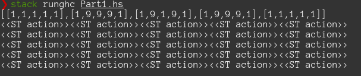

# Day 11: [Dumbo Octopus](https://adventofcode.com/2021/day/11)
*Haskell: [Part 1](https://github.com/DestyNova/advent_of_code_2021/blob/main/day11/Part1.hs) (04:04:16, rank 12437), [Part 2](https://github.com/DestyNova/advent_of_code_2021/blob/main/day11/Part2.hs) (04:08:57, rank 12265))*

A disastrous affair today. This is the first of the challenges where I came very close to just giving up. I'm really inclined to stay the hell away from the State monad unless a very simple and clearly necessary situation arises, like one of the crab cups puzzles last year.

## Part 1
At first I figured I could reuse much of the code from [day 9's "Smoke Basin"](https://adventofcode.com/2021/day/9) challenge. But I realised that the number and pattern of updates wasn't really amenable to that, and decided to try unboxed mutable arrays with `STUArray` in the `ST` monad.

This was a terrible decision, at least with my current poor level of Haskell knowledge. I got completely stuck just trying to force evaluation of the ST actions and pull them out for debug display. Seriously, I spent about 3 hours trying to figure that out, but kept running into problems with mismatched type variables (`ScopedTypeVariables` and `ExplicitForall` didn't help).

When I finally got something to compile, I had to stop and walk away for a few minutes when my updated "grid" was printed like this:

After a cup of coffee and a few minutes to ponder things over, I decided to get rid of all of the `ST` monad and `STUArray` code and rewrite it all with boring old immutable `Data.Map (Int,Int) Int`. This turned out to be perfectly adequate for the task, although I still struggled with the application of flashes. The first nearly-working versions were collecting a list of octopus positions to flash, but duplicate coordinates were making their way in there. As usual, rather than doing something clever here, I just used `nub` to weed out duplicates before the next recursive call to `doFlashes`.

## Part 2
This part took about 4 minutes and was extremely trivial after all of the work for part 1. Instead of applying a fixed number of simulation steps, we keep going and count the number of steps executed until the entire grid is equal to zero.
